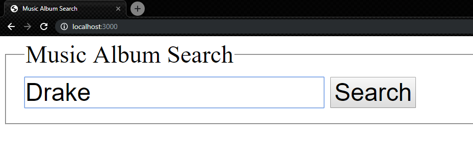
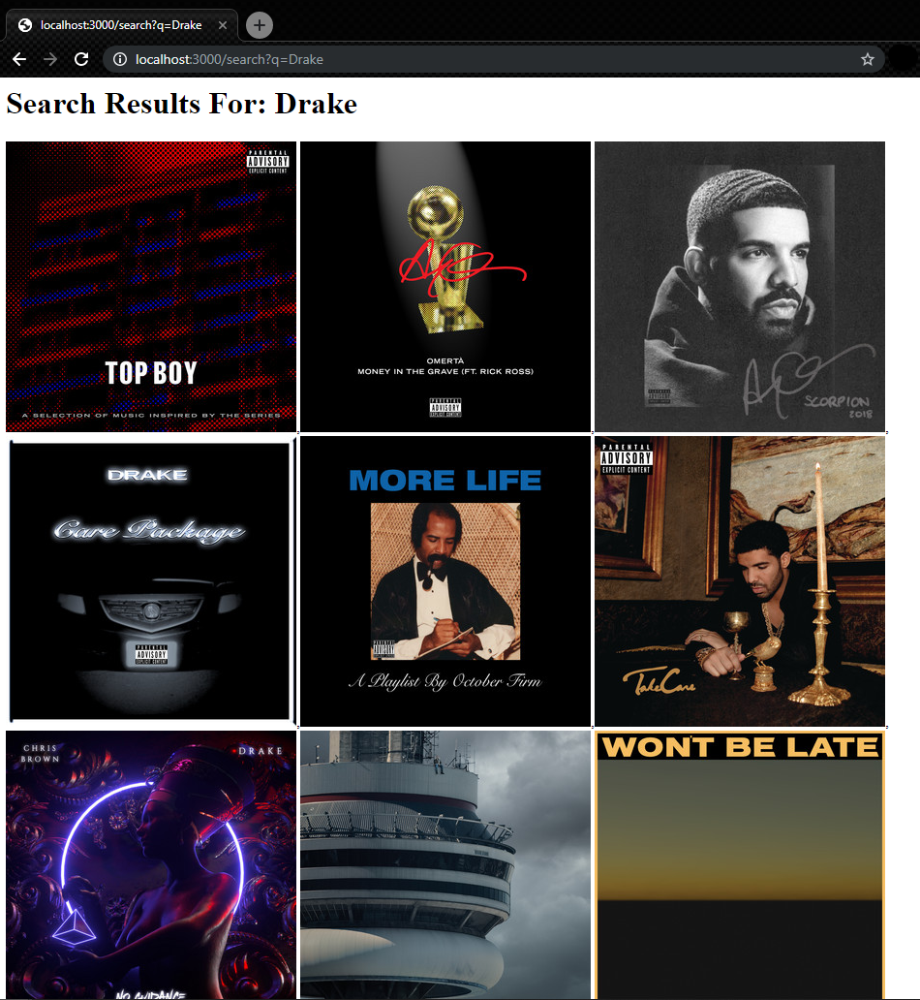
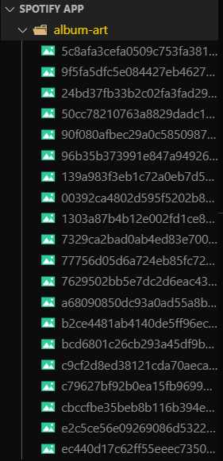

# Spotify Album Art App

### This application was created using only **NodeJS modules** such as the *fs* and *https* modules to create a server from scratch and display the album arts onto the webpage after the user sends a request with the name of the artist of their choosing. All album arts that are displayed on screen are cached into the album-art directory. 

### To start the server, enter `node index.js` in the directory.

### To exit the server, press *Ctrl+C*.

### Restart the server to delete the cache. This can be done by exiting the server (*Ctrl+C*) and starting the server again (`node index.js`).

---

### Home Page

---

### Results Page

---

### Album Art Cache

---